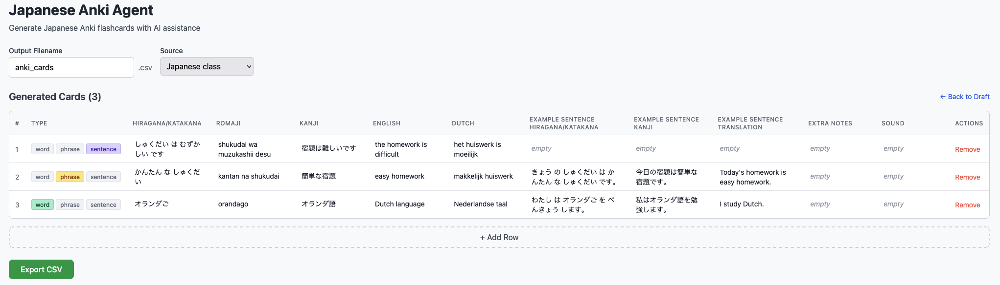

# Japanese Anki Agent

> **Note:** This is a personal hobby project created as part of my Japanese learning journey. The entire codebase was written by [Claude Code](https://claude.ai/code). Feel free to use, modify, and learn from it!

## Screenshot



An AI-powered web application for generating Japanese vocabulary and sentence flashcards for Anki. Built with a FastAPI backend and Next.js frontend, this tool uses the Claude Agent SDK to intelligently generate comprehensive flashcard data from minimal input.

## Features

- **Draft Cards**: Create multiple draft cards with raw input (romaji, kana, kanji, Dutch, or mixed)
- **AI-Powered Generation**: Uses Claude to generate complete flashcard fields including translations, example sentences, and proper romanization
- **Fixed Translations**: Optionally lock specific English or Dutch translations to appear first with an asterisk marker
- **Editable Preview**: Review and edit all generated fields before export
- **Tag Support**: Assign tags (word, phrase, sentence) to organize your cards
- **CSV Export**: Export cards in Anki-compatible CSV format for easy import

## Prerequisites

Before you begin, ensure you have the following installed:

- **Python 3.10+** - Backend server
- **Node.js 18+** - Frontend application
- **Claude Code CLI** - Required for the Claude Agent SDK integration
- **Claude OAuth Token** - Authentication for Claude API

### Installing Claude Code CLI

The Claude Agent SDK requires Claude Code CLI to be installed. Visit the [Claude Code documentation](https://docs.anthropic.com/en/docs/claude-code) for installation instructions.

## Setup Instructions

### Backend Setup

1. Navigate to the backend directory:
   ```bash
   cd backend
   ```

2. Create and activate a virtual environment:
   ```bash
   python -m venv venv
   source venv/bin/activate  # On Windows: venv\Scripts\activate
   ```

3. Install dependencies:
   ```bash
   pip install -r requirements.txt
   ```

   If you encounter SSL certificate errors (e.g., behind a corporate proxy), use:
   ```bash
   pip install --trusted-host pypi.org --trusted-host files.pythonhosted.org -r requirements.txt
   ```

4. Create the environment file:
   ```bash
   cp .env.example .env
   ```

5. Edit `.env` and add your Claude OAuth token:
   ```
   CLAUDE_CODE_OAUTH_TOKEN=your_oauth_token_here
   ```

6. Run the development server:
   ```bash
   uvicorn app.main:app --reload
   ```

   The API will be available at `http://localhost:8000`.

### Frontend Setup

1. Navigate to the frontend directory:
   ```bash
   cd frontend
   ```

2. Install dependencies:
   ```bash
   npm install
   ```

3. Create the environment file:
   ```bash
   cp .env.local.example .env.local
   ```

4. Edit `.env.local` if needed (defaults to `http://localhost:8000`):
   ```
   NEXT_PUBLIC_API_URL=http://localhost:8000
   ```

5. Run the development server:
   ```bash
   npm run dev
   ```

   The application will be available at `http://localhost:3000`.

## Environment Variables

### Backend (`backend/.env`)

| Variable | Description | Required |
|----------|-------------|----------|
| `CLAUDE_CODE_OAUTH_TOKEN` | OAuth token for Claude API (from `claude setup-token`) | One of these |
| `ANTHROPIC_API_KEY` | Anthropic Console API key (alternative to OAuth token) | One of these |
| `DEBUG` | Set to `1` to enable verbose debug logging | No |
| `API_KEY` | Optional API key for endpoint authentication. If set, requests to /api/generate, /api/regenerate-card, and /api/export must include X-API-Key header | No |

**Note:** You need EITHER `CLAUDE_CODE_OAUTH_TOKEN` OR `ANTHROPIC_API_KEY` (not both). If you have already authenticated the Claude Code CLI by running `claude` in your terminal, the SDK can use that authentication automatically and neither variable is required.

### Frontend (`frontend/.env.local`)

| Variable | Description | Default |
|----------|-------------|---------|
| `NEXT_PUBLIC_API_URL` | Backend API URL | `http://localhost:8000` |

## Usage Guide

### 1. Adding Draft Cards

Enter your Japanese word or sentence in the input field. You can use:
- Romaji: `futsuu`, `oranda`
- Hiragana/Katakana: `ふつう`, `オランダ`
- Mixed: `きょう は 9じ に ねます`
- Dutch words: `Nederland`

### 2. Using Fixed Translations

If you want a specific translation to appear first (marked with an asterisk), enter it in the "Fixed English" or "Fixed Dutch" field. The AI will include additional translations but your fixed translation will appear first with `*`.

### 3. Selecting Tags

Click on available tags (word, phrase, sentence) to assign them to your card. Tags help organize cards in Anki.

### 4. Generating Cards

Click the "Generate" button to process all draft cards. The AI will:
- Detect if input is a vocabulary word or complete sentence
- Generate hiragana/katakana with proper spacing
- Create romaji using Hepburn romanization
- Add kanji where appropriate
- Generate English and Dutch translations
- Create an example sentence (for vocabulary words)
- Apply your fixed translations with asterisk markers

### 5. Editing Generated Cards

After generation, review the table of generated cards. Click on any cell to edit its value directly. All changes are saved locally until you export.

### 6. Exporting CSV

Enter a filename and click "Export CSV" to download the cards. Import the CSV into Anki using File > Import.

## Setting Up Anki Note Type

Before importing cards, you need to create a matching note type in Anki. There are two methods:

### Method 1: Using Add-on (Recommended)

1. **Install the Templates Import/Export add-on:**
   - Open Anki > Tools > Add-ons > Get Add-ons
   - Enter code: `712027367`
   - Restart Anki

2. **Create the note type with fields:**
   - Tools > Manage Note Types > Add > Basic
   - Name it: `Japanese Vocabulary (Agent)`
   - Click Fields and create (in order):
     - `Hiragana/Katakana`, `Romaji`, `Kanji`, `English`, `Dutch`
     - `Example sentence hiragana/katakana`, `Example sentence kanji`
     - `Example sentence translation`, `Extra notes`, `Sound`, `Sound example`

3. **Import templates:**
   - Copy `docs/anki-templates/` folder from this repo
   - Tools > Templates Import / Export > Import
   - Select the `anki-templates` folder

### Method 2: Manual Setup

1. Create note type and fields (same as Method 1, step 2)
2. Open Cards template editor
3. Copy templates and CSS from `docs/anki-note-type.md`

For detailed instructions, see [docs/anki-note-type.md](docs/anki-note-type.md).

## Configuration

### Config File (`config/anki_config.json`)

The configuration file defines the fields and tags available for card generation:

```json
{
  "fields": [
    "Hiragana/Katakana",
    "Romaji",
    "Kanji",
    "English",
    "Dutch",
    "Example sentence hiragana/katakana",
    "Example sentence kanji",
    "Example sentence translation",
    "Extra notes",
    "Sound",
    "Sound example"
  ],
  "tags": ["word", "phrase", "sentence"],
  "tagsColumnEnabled": true,
  "tagsColumnName": "Tags",
  "sources": [
    { "label": "Japanese class", "tag": "japanese_class" },
    { "label": "Other", "tag": "other" }
  ],
  "defaultSource": "japanese_class"
}
```

### Customizing Fields

To add or remove fields, edit the `fields` array. The order in this array determines:
- The column order in the generated table
- The column order in the exported CSV

**Note**: If you add new fields, you may need to update the generation prompt in `backend/app/prompts/generation.py` to include instructions for the new field.

### Customizing Tags

To add or remove tags, edit the `tags` array. These will appear as selectable options in the UI.

### Disabling Tags Column

Set `tagsColumnEnabled` to `false` to exclude the tags column from the CSV export.

### Customizing Sources

The `sources` array defines selectable source tags for cards. Each source has:
- `label`: Display name shown in the UI
- `tag`: The tag value added to exported cards

The `defaultSource` specifies which source is selected by default.

## Example Inputs and Expected Outputs

### Example 1: Dutch Word "Nederland"

**Input:**
- Raw input: `Nederland`
- Tags: `word`

**Expected Output:**

| Field | Value |
|-------|-------|
| Hiragana/Katakana | オランダ |
| Romaji | oranda |
| Kanji | *(empty)* |
| English | Netherlands |
| Dutch | Nederland |
| Example sentence hiragana/katakana | オランダ に すんでいます。 |
| Example sentence kanji | オランダに住んでいます。 |
| Example sentence translation | I live in the Netherlands. |

**Note**: The kana field uses katakana for this loanword, and the example sentence has spaces between words in the kana version.

### Example 2: Romaji with Fixed Dutch Translation

**Input:**
- Raw input: `futsuu`
- Fixed Dutch: `meestal`
- Tags: `word`

**Expected Output:**

| Field | Value |
|-------|-------|
| Hiragana/Katakana | ふつう |
| Romaji | futsuu |
| Kanji | 普通 |
| English | usually, ordinary, normal |
| Dutch | meestal*, gewoonlijk, normaal |
| Example sentence hiragana/katakana | ふつう でんしゃ で いきます。 |
| Example sentence kanji | 普通電車で行きます。 |
| Example sentence translation | I usually go by train. |

**Note**: The fixed Dutch translation "meestal" appears first with an asterisk (`*`), followed by AI-generated alternatives.

### Example 3: Complete Sentence Input

**Input:**
- Raw input: `きょう は 9じ に ねます`
- Tags: `sentence`

**Expected Output:**

| Field | Value |
|-------|-------|
| Hiragana/Katakana | きょう は 9じ に ねます。 |
| Romaji | kyou wa kuji ni nemasu |
| Kanji | 今日は9時に寝ます。 |
| English | Today I will go to bed at 9 o'clock. |
| Dutch | Vandaag ga ik om 9 uur slapen. |
| Example sentence hiragana/katakana | きょう は 9じ に ねます。 |
| Example sentence kanji | 今日は9時に寝ます。 |
| Example sentence translation | Today I will go to bed at 9 o'clock. |

**Note**: When the input is detected as a complete sentence, the same sentence is used for both the main fields and the example sentence fields (no additional example is generated).

## API Endpoints

### GET /api/config

Returns the current Anki configuration including available fields and tags.

**Response:**
```json
{
  "fields": ["Hiragana/Katakana", "Romaji", ...],
  "tags": ["word", "phrase", "sentence"],
  "tagsColumnEnabled": true,
  "tagsColumnName": "Tags"
}
```

### POST /api/generate

Generates flashcard data for the provided draft cards using Claude AI.

**Request:**
```json
{
  "draft_cards": [
    {
      "raw_input": "futsuu",
      "fixed_english": null,
      "fixed_dutch": "meestal",
      "extra_notes": null,
      "tags": ["word"]
    }
  ],
  "filename": "my_cards"
}
```

**Response:**
```json
{
  "cards": [
    {
      "fields": {
        "Hiragana/Katakana": "ふつう",
        "Romaji": "futsuu",
        "Kanji": "普通",
        ...
      },
      "tags": ["word"]
    }
  ],
  "filename": "my_cards"
}
```

### POST /api/export

Exports generated cards to CSV format.

**Request:**
```json
{
  "cards": [...],
  "filename": "my_cards"
}
```

**Response:** CSV file download

### GET /health

Health check endpoint.

**Response:**
```json
{
  "status": "healthy"
}
```

## Project Structure

```
japanese-anki-agent/
├── backend/
│   ├── app/
│   │   ├── main.py           # FastAPI application entry point
│   │   ├── config.py         # Configuration loading
│   │   ├── models.py         # Pydantic models
│   │   ├── routes/           # API endpoint definitions
│   │   │   └── config.py     # Config endpoints
│   │   ├── services/         # Business logic
│   │   │   ├── agent.py      # Claude Agent SDK integration
│   │   │   └── validator.py  # Card validation
│   │   └── prompts/          # AI prompt templates
│   │       └── generation.py # Card generation prompts
│   ├── tests/                # Backend tests
│   ├── requirements.txt      # Python dependencies
│   └── .env.example          # Environment template
├── frontend/
│   └── src/
│       ├── app/              # Next.js app router pages
│       │   ├── layout.tsx    # Root layout
│       │   └── page.tsx      # Main page
│       ├── components/       # React components
│       │   ├── DraftCardForm.tsx
│       │   ├── DraftCardList.tsx
│       │   ├── GeneratedTable.tsx
│       │   ├── TagSelector.tsx
│       │   └── ExportButton.tsx
│       ├── hooks/            # Custom React hooks
│       │   └── useAnkiAgent.ts
│       ├── lib/              # Utility functions
│       │   └── api.ts        # API client
│       └── types/            # TypeScript type definitions
│           └── index.ts
├── config/
│   └── anki_config.json      # Field and tag configuration
└── README.md
```

## Development Notes

### Running Tests

**Backend:**
```bash
cd backend
source venv/bin/activate
pytest
```

**Frontend:**
```bash
cd frontend
npm test
```

### Modifying Generation Rules

The AI generation behavior is controlled by the prompt template in `backend/app/prompts/generation.py`. Key sections include:

- **Sentence vs Vocabulary Detection**: Rules for detecting if input is a complete sentence
- **Kana-Only Fields**: Ensuring no kanji appears in kana fields
- **Romaji Rules**: Hepburn romanization standards
- **Translation Rules**: How fixed translations are formatted with asterisks
- **Example Sentence Generation**: When and how to generate example sentences

To modify generation behavior:
1. Edit `backend/app/prompts/generation.py`
2. Update the `build_generation_prompt()` function
3. Test with various inputs to verify the changes

### Validation

The `backend/app/services/validator.py` module validates generated cards against rules such as:
- Kana fields must not contain kanji
- Sentences must end with Japanese period (。)
- All required fields must be present

If validation fails, the system attempts automatic repair using the `build_repair_prompt()` function.

## Troubleshooting

### Common Issues

**"No result received from Claude agent"**
- Ensure your `CLAUDE_CODE_OAUTH_TOKEN` is valid
- Check that Claude Code CLI is properly installed

**CORS Errors**
- Verify the backend is running on `localhost:8000`
- Check that `NEXT_PUBLIC_API_URL` matches your backend URL

**Generation Quality Issues**
- Review and adjust prompts in `backend/app/prompts/generation.py`
- Check the validation rules in `backend/app/services/validator.py`

## License

MIT License - See LICENSE file for details.
